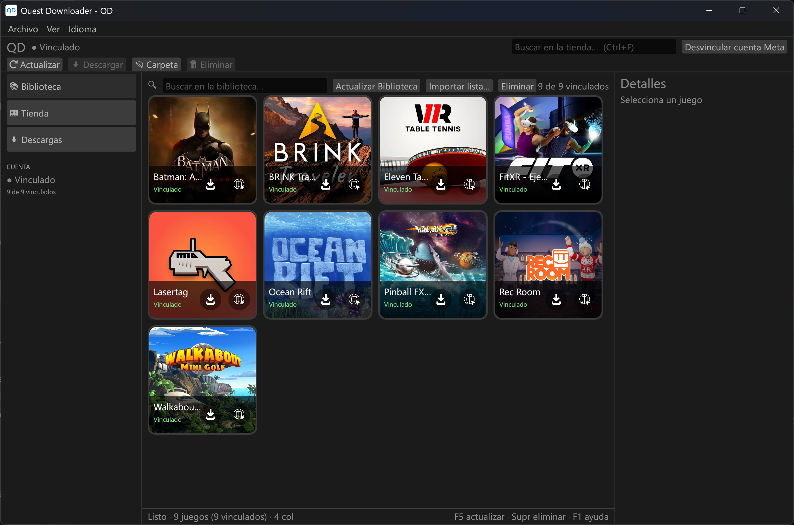

# Quest Downloader — QD

> 🇬🇧 Prefer English? Read [README.md](README.md).

**Quest Downloader (QD)** es una aplicación portable de escritorio para Windows (Rust + egui)
para gestionar tu biblioteca de Meta Quest: vincula tu cuenta de Meta, explora tus juegos
con sus portadas, busca en el catálogo de la Meta Quest Store y descarga juegos
(APK + datos/OBB + paquetes opcionales de idioma).

- Un solo ejecutable portable, sin instalador ni ventana de consola.
- Tres secciones: **Biblioteca**, **Tienda**, **Descargas**.
- Interfaz en **español e inglés** (auto según la configuración regional de Windows,
  cambiable en el menú *Idioma*).
- Los tokens de la cuenta se protegen con DPAPI de Windows; el inicio de sesión es local
  en tu navegador predeterminado (Chromium o Firefox, Edge como alternativa).

## Capturas



## Instalación

1. Consigue `QD.exe` (ver *Compilar desde el código*) o usa el instalador
   `QD-Setup-1.0.1.exe` (instala en `C:\QD` por defecto, así datos y
   descargas quedan junto al ejecutable; solo si se instala en un sitio
   no escribible van a `%LOCALAPPDATA%\QD`).
2. Ponlo en cualquier carpeta y ejecútalo. Nada más.
3. En el primer arranque crea junto al ejecutable:
   - `data/` — base de datos (`data.db`), portadas en caché (`covers_v2/`) y tokens.
   - `Downloads/` — una carpeta por juego (`base.apk`, OBB, JSON, portada).

Requisitos: Windows 10/11 de 64 bits. Sin runtimes, sin permisos de administrador.

## Uso

1. **Vincula tu cuenta de Meta**: botón superior derecho *Vincular cuenta Meta*. Se abre
   el inicio de sesión de Meta; al completarlo la biblioteca se sincroniza sola. Vinculada,
   el botón pasa a *Desvincular cuenta Meta* (desvincula al pulsarlo).
2. **Biblioteca**: tus juegos en fichas uniformes (la portada ocupa toda la ficha). Pulsa
   una ficha para seleccionarla (panel Detalles a la derecha). Iconos sobre la portada:
   - flecha ⬇ — abre el diálogo de descarga, o la carpeta si ya está descargado;
   - globo 🌐 — abre la ficha del juego en la Store de Meta.
3. **Diálogo de descarga**: el contenido base va como paquete único (APK + datos, siempre
   incluido). Lo opcional se agrupa **por idioma** (textos + audio en un paquete por idioma);
   los idiomas ya incluidos en la base no se ofrecen. Al confirmar sigues en la misma vista
   y el progreso se ve como una línea fina al pie de la ficha.
4. **Tienda**: busca en el catálogo de la Store, abre resultados en la Store, añádelos a tu
   biblioteca o descárgalos directamente.
5. **Descargas**: descargas en curso con progreso, pausa/reanudación/cancelación y botón
   *Abrir carpeta*. Se reanudan con `Range` HTTP donde el servidor lo permite.

Teclado: `F5` actualizar biblioteca, `Supr` eliminar seleccionado, `Ctrl+1/2/3` cambiar
de sección.

Notas:

- Solo se puede descargar el contenido propiedad de la cuenta vinculada; el resto lo
  rechazan los servidores de Meta.
- Las portadas se cachean en `data/covers_v2/`; los datos van en SQLite local.

## Compilar desde el código

Requisitos: Rust estable (toolchain MSVC), Windows SDK 10/11 (MSVC + `rc.exe` para el icono):

```bat
cargo build --release
```

El binario queda en `target\release\QD.exe`. El icono sale de `assets/icon.ico`
(incrustado al compilar).

## Estructura

```text
src/
  main.rs       Interfaz (egui) + diálogo de descarga + i18n
  meta_auth.rs  SSO de Meta (navegador predeterminado), biblioteca, plan APK+datos, DPAPI
  oculusdb.rs   Catálogo público + portadas
  downloader.rs Descargas reanudables multihilo
  store.rs      Persistencia SQLite (biblioteca, ajustes)
icons/          Iconos de la interfaz (descarga, globo)
assets/         Icono de la aplicación (.ico/.png)
```

## Problemas conocidos

### Error 500 al sincronizar la biblioteca

Si la sincronización falla con error 500 (puede pasar con bibliotecas muy grandes),
deja la cuenta vinculada y añade los juegos uno por uno desde la
sección **Tienda** (buscar → *Añadir a la biblioteca*) o descárgalos
directamente desde la tienda.

## Aviso

Proyecto comunitario no oficial. Sin afiliación ni respaldo de Meta. Todo el contenido
pertenece a sus propietarios y se descarga de los servidores de Meta con los derechos de
la cuenta vinculada.

## Apoyo

[☕ Apóyame en Ko-fi](https://ko-fi.com/M4A0285O9U)
